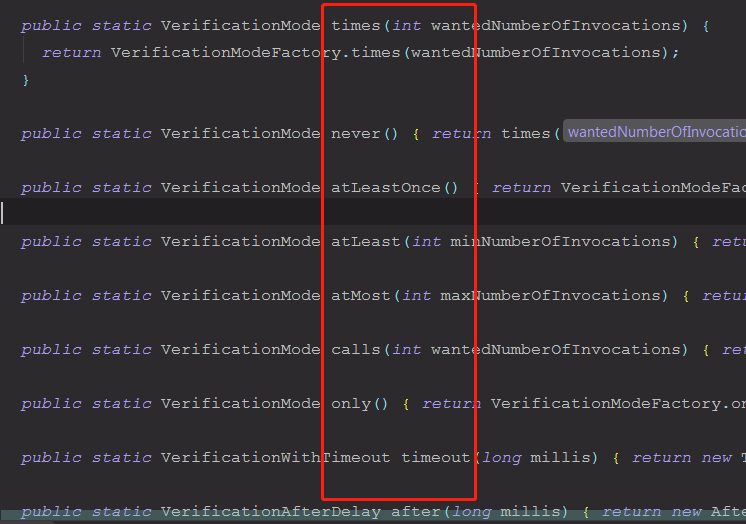

# Practice for PowerMock on SpringBoot project

> PowerMock 目前仅支持 EasyMock 和 Mockito

### 此Demo用到的测试框架
* JUnit 4.12
* Mockito
* PowerMock

### 框架背景
* EasyMock 和 Mockito都是简化测试编写的工具，但是都不可以实现对静态函数、构造函数、私有函数、Final函数以及系统函数的模拟。
* PowerMock是 上面两者的扩展，通过定制加载器等技术，实现以上两者没有实现的所有Mock。
* Mockito的优点：相对于EasyMock和jMock，他是通过在执行之后校验哪些函数已经被调用，消除了对期望行为（expections）的需要。【其他的Mocking库需要在执行之前就记录期望行为（expectations）】
* Mockito的缺点：不提供 静态函数、构造函数、私有函数、Final函数 的Mock支持。
* PowerMock 目前仅支持 EasyMock 和 Mockito。


### 本项目用到的测试和Mock框架一览：
```xml
<properties>
    <powermock.version>1.6.6</powermock.version>
</properties>
<!-- https://mvnrepository.com/artifact/org.powermock/powermock-module-junit4 -->
<dependency>
    <groupId>org.powermock</groupId>
    <artifactId>powermock-module-junit4</artifactId>
    <version>${powermock.version}</version>
    <scope>test</scope>
</dependency>

<!-- https://mvnrepository.com/artifact/org.powermock/powermock-api-mockito -->
<dependency>
    <groupId>org.powermock</groupId>
    <artifactId>powermock-api-mockito</artifactId>
    <version>${powermock.version}</version>
    <scope>test</scope>
</dependency>

<!-- https://mvnrepository.com/artifact/org.mockito/mockito-core -->
<dependency>
    <groupId>org.mockito</groupId>
    <artifactId>mockito-core</artifactId>
    <version>2.8.9</version>
    <scope>test</scope>
</dependency>
```
其中，很关键是：v2.8.9的`mockito`版本。 因为 ，v1.7.X 版本的`powermock-api-mockito` 只支持 2.8.0~2.8.9 版本的 `mockito`。

### 公共步骤：
1. 所有需要使用到`PowerMock`的Test类，都需要这个声明：
  ```
  @RunWith(PowerMockRunner.class)
  ```
2. 然后，将你原来的带有注解`@Autowired`的被测对象，换成`@InjectMocks`

### 实例：
- Mock Service中的DAO：
  1. 这过程只会用到Mockito，所以，第一步，把被测对象和要Mock对象标上对应注解，并进行初始化Mock：
     ```java
     @InjectMocks
     private ConsumeRecordServiceImpl consumeRecordService;
     
     @Mock
     private ConsumeRecordDAOImpl consumeRecordDAO;
     
     @Before
     public void setUp() {
       MockitoAnnotations.initMocks(this);
     }
     ```
  2. 然后，直接标准的mockito语句Mock一波：
     ```java
     when(consumeRecordDAO.xxxxx("A")).thenReturn(null);
     ......
     Assert.assertTrue(xxxx);
     ```

- Mock 静态方法：
  1. 将Test类名上面的注解替换一波
        ```java
        @RunWith(SpringRunner.class)
        @SpringBootTest
        ```
        换成
        ```java
        @SpringBootTest
        // step1
        @RunWith(PowerMockRunner.class)
        // step2
        @PrepareForTest({你要Mock的静态方法所在类.class})    
        ```
  2. 所有需要使用到`PowerMock`的Test类，都需要这个声明：
       ```
       @RunWith(PowerMockRunner.class)
       ```
  3. 在跑test流程开始前，mock掉你想mock的静态方法
        ```java
        @Test
        public void test() throws Exception {
        //    step4
          PowerMockito.mockStatic(DateUtil.class);
          SimpleDateFormat format = new SimpleDateFormat("yyyy-MM-dd HH:mm:ss");
          Date tmr = format.parse("2018-05-02 00:00:00");
        //    setp5
          PowerMockito.when(DateUtil.addDay(null,1)).thenReturn(tmr);
          .................
        }
        ```
- Mock 被测对象中的private方法：
  1. 因为要用到PowerMock，所以，前几步同上
     ```java
     @SpringBootTest
     @RunWith(PowerMockRunner.class)
     @PrepareForTest(被测类.class)
     public class Test {
     .......
     @InjectMocks
     被测类 被测实例;
     ```
  2. 在test方法中，用`spy(被测类实例)`来获得一个可mock部分功能的实例。
     ```java
     @Test
     public void testMethod() throws Exception {
         被测类 可部分mock的对象 = PowerMockito.spy(被测实例);
         ........
     }
     ```
  3. 然后，就mock这个对象的对应的private方法
     ```java
     PowerMockito.doReturn("yyy").when(可部分mock的对象, "private方法", "参数1", "参数2");
     ```

- Mock final 的方法（用到`PowerMockito.mock()`）
  ```java
  @RunWith(PowerMockRunner.class)
  @PrepareForTest({ Final方法所在类.class })
  public class LoginServiceImplTest {
  
    @InjectMocks
    LoginServiceImpl 被测实例;
  
    @Test
    public void testMockFinalMethod() throws Exception {
      //    FinalValidator finalValidatorMock = Mockito.mock(FinalValidator.class);
      FinalValidator Final方法所在类的Mock对象 = PowerMockito.mock(Final方法所在类.class);
      when(Final方法所在类的Mock对象.final方法()).thenReturn("B");
      loginService.setFinal方法所在类的Mock对象(Final方法所在类的Mock对象);
  
      Assert.assertEquals(true, loginService.login("B", "123456"));
    }
  }
  ```

- 验证某private方法被调用的次数
  ```java
  PowerMockito.verifyPrivate(可部分mock的对象, times(次数)).invoke("private方法", "参数");
  ```
- 使用Mockito的`any`的正确方式
  1. 假设`controller`有个要被mock的方法是`run(int a, String b)`
  2. 那么， 当我们使用`ArgumentMatchers.any`时，要注意：要替换方法的所有参数，而不是某个参数，否则报错。
  3. 使用`when...thenReturn...` 或者 `doReturn...when...`时，是这样用的：
     ```java
     when(controller.run(any(),eq("abc"))).thenReturn(tmr);
     或者
     when(controller.run(any(),anyString())).thenReturn(tmr);
     ```
- 验证private方法跑了多少次：
  ```java
  PowerMockito.verifyPrivate(controller, times(2)).invoke("run", anyInt(), eq("123456"));
  ```
  > 注意：这里的`anyInt()`和`eq()`都是`org.mockito.ArgumentMatchers.*`下面的静态方法
- 验证static方法跑了多少次：
  ```java
  PowerMockito.verifyStatic(DateUtil.class, times(1));
  PowerMockito.verifyStatic(DateUtil.class, never());
  ```
  > `times()`和`never()`这些验证器，都来自：`Mockito`
  > 
- 一般情况下的验证（纯Mockito）：
  ```java
  UserController userControllerMock = mock(UserController.class);
  userControllerMock.login("A","123456");
  userControllerMock.login("B","123456");
  
  /// 一般，验证是否被执行了一次
  //    Mockito.verify(userControllerMock).login(anyString(),anyString());
  /// 验证是否被执行了2次
  Mockito.verify(userControllerMock, times(2)).login(anyString(),anyString());
  /// 验证是否从未执行
  Mockito.verify(userControllerMock, never()).login(anyString(),eq("123"));
  /// 验证至少
  Mockito.verify(userControllerMock, atLeast(1)).login("A","123456");
  /// 验证至多
  Mockito.verify(userControllerMock, atMost(2)).login(anyString(),eq("123456"));
  ```

#### verify一个静态方法被执行了多少次
```
PowerMockito.verifyStatic(DataFlowTracing.class, times(1));
DataFlowTracing.milestone(any(MilestoneBean.class));
```

### 注意点
- `@SpringBootTest`并不是unit test 必需的
  - 用`@InjectMocked`注入被测对象，不需要`@SpringBootTest`注解
  - 但是如果使用`@Autowired`，则需要`@SpringBootTest`这个注解。


### 参考文章
- [github教程](https://github.com/powermock/powermock/wiki/Mockito#a-full-example-for-mocking-stubbing--verifying-static-method)
- [关于使用any时报错的解决方法（eq）](https://stackoverflow.com/questions/14845690/mockito-invaliduseofmatchersexception)
